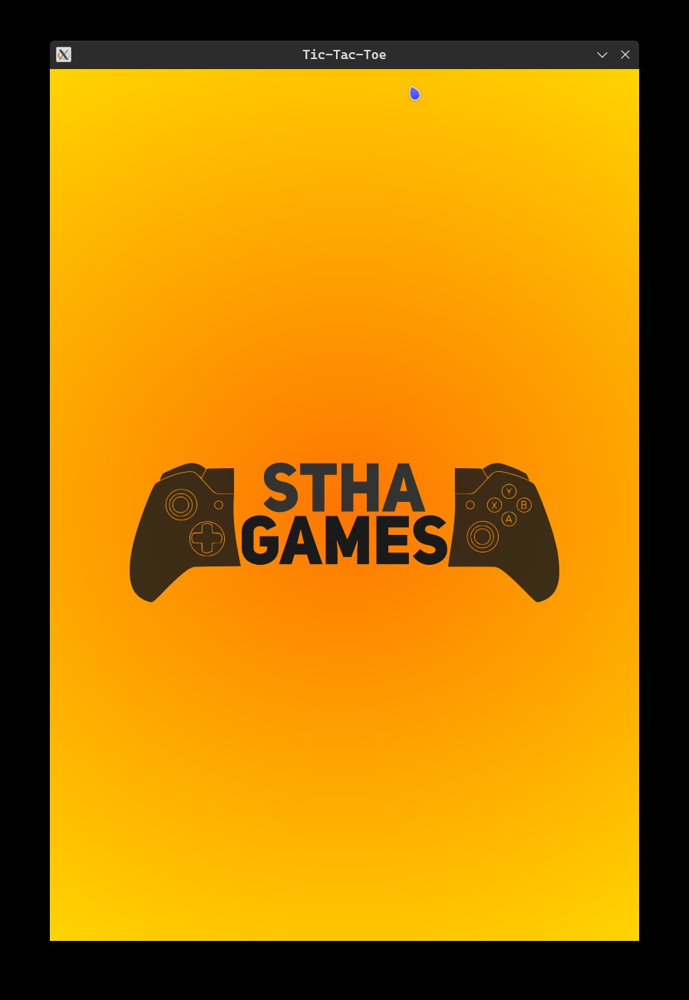
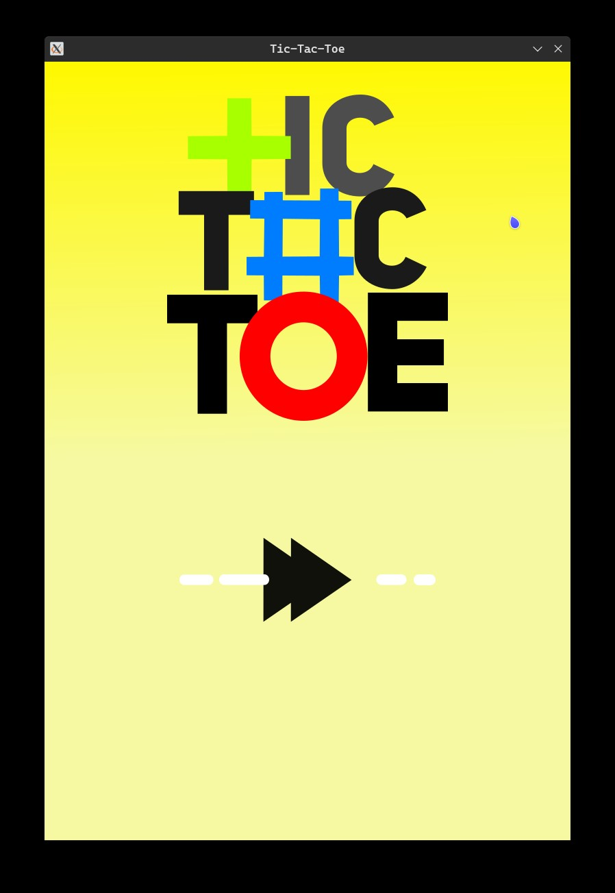
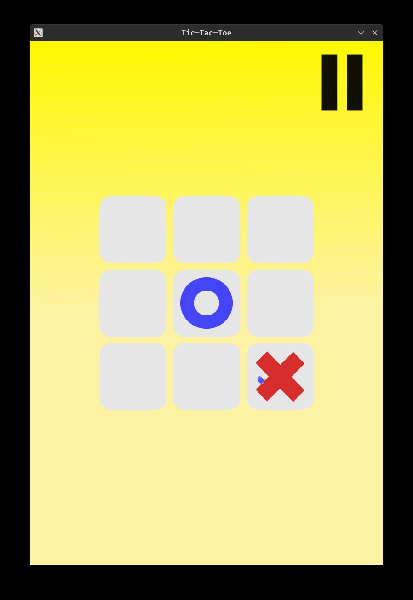
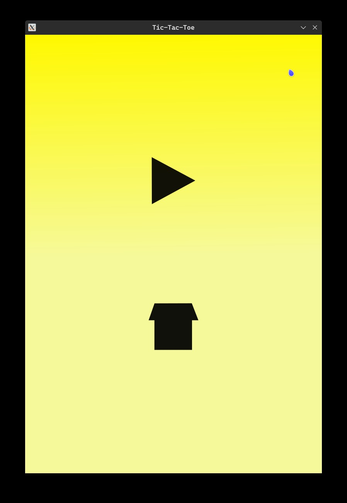

# TicTacToe

[](https://shields.io/)

A simple **Tic-Tac-Toe** game built in **C++** using **SFML Library**

## Screenshots






## Changelog

- v.0.4 Added all required States : Game, Pause, Gameover States
- v.0.3 Added a Main Menu State
- v.0.2 Added a Splash Screen State
- v.0.1 Created Game Engine

## System Requirements

Currrently tested only on **linux system (Ubuntu 20.04)**

## Usage

### **Pre-built**

- to run directly from the binary (if available)

    ``` BASH
    ./bin/main
    ```

### **Rebuild**

1. ### **Setup Scripts**  

    Rebuilding requires the execution of scripts. To make the bash scripts executable please copy the following commands to your bash terminal  

    ``` BASH
    chmod +x scripts/*.sh
    ```

2. ### **Setup Dependencies**  

    You only need to setup dependencies once. Please execute the following script to install dependencies.  

    ``` BASH
    ./scripts/setup.sh
    ```

3. ### **Compile the program**  

    Run bash script to compile the program.

    ``` BASH
    ./scripts/compiler.sh
    ```

4. ### **Launch application**

    To run the program after compiling, execute:  

    ``` BASH
    ./scripts/run.sh
    ```

## Depedencies

- C++ compiler
- SFML library

## References

- Based on: **[Solar Systems- TIC TAC TOE](https://github.com/SonarSystems/Tic-Tac-Toe-SFML-CPP)**
- Tutorial Followed: **[Sonar Systems- YouTube](https://www.youtube.com/playlist?list=PLRtjMdoYXLf4L0UVTggZdTV55baO6x6CO)**
